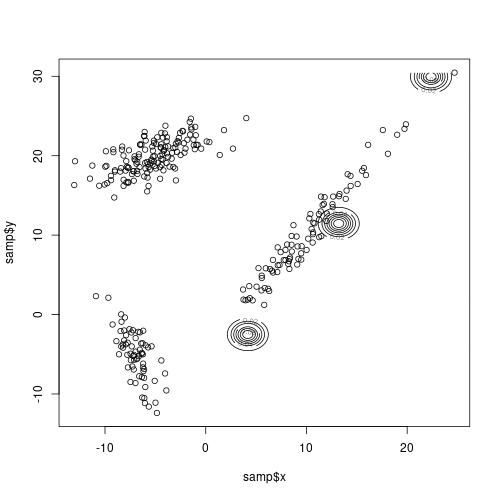
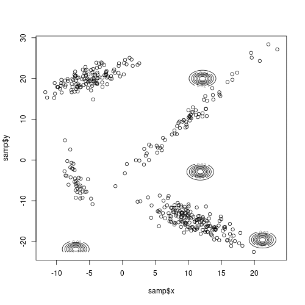

# EM-агоритм

```{r}
library(MASS)
library(dplyr)
library(mvtnorm)
library(animation)
set.seed(123)
```

## Моделируем смесь двухмерных нормальных

```{r}
r_k_2Dnorm <- function(n = 1, weight = c(1), param_m = list(m_1 = c(0, 0)), param_sigma = list(sigma_1 = matrix(c(1, 0, 0, 1), ncol = 2))){
  res <- data.frame(z = rep(0, n), x = rep(0, n), y = rep(0, n))
  weight <- cumsum(weight)
  
  res$z <- sapply(runif(n), function(x){
    k <- 1
    
    while (x > weight[k]){
      k <- k + 1
    }
    
    k
  })
  
  for (i in 1:length(weight)){
    res[res$z == i, c(2, 3)] = as.data.frame(mvrnorm(length(which(res$z == i)), mu = param_m[[i]], Sigma = param_sigma[[i]]))
  }
  
  res <- subset(res, select = -z)
  res
}
```

Задаём параметры и смотрим на выборку:

```{r}
num <- 3
n <- 300
tau <- c(0.3, 0.2, 0.5)
mu_1 <- c(10, 10)
mu_2 <- c(-7, -5)
mu_3 <- c(-5, 20)
sigma_1 <- matrix(c(20, 28, 28, 41), ncol = 2)
sigma_2 <- matrix(c(1.25, -2, -2, 9.25), ncol = 2)
sigma_3 <- matrix(c(10, 5, 5, 5), ncol = 2)

param_m <- list(mu_1 = mu_1, mu_2 = mu_2, mu_3 = mu_3)
param_sigma <- list(sigma_1 = sigma_1, sigma_2 = sigma_2, sigma_3 = sigma_3)

samp <- r_k_2Dnorm(n, tau, param_m, param_sigma)

tau
param_m
param_sigma

plot(x = samp$x, y = samp$y)
```

```{r}
plot_dens_point <- function(samp, param_m = list(m_1 = c(0, 0)), param_sigma = list(sigma_1 = matrix(c(1, 0, 0, 1), ncol = 2))){
  n <- length(param_m)
  x <- seq(min(samp$x), max(samp$x), by=.1)
  y <- seq(min(samp$y), max(samp$y), by=.1)
  plot(x = samp$x, y = samp$y)
  
  for (i in 1:n){
    net <- outer(x, y, function(x,y) dmvnorm(cbind(x,y), param_m[[i]], param_sigma[[i]]))
    contour(x, y, net, add=T)
  }
}
```

Как выглядят наложенные функции плотности:

```{r}
plot_dens_point(samp, param_m, param_sigma)
```

## Алгоритм и оценки

```{r}
getT_ij <- function(num, j, xy, tau, param_m, param_sigma){
  sum <- 0
  
  for (i in 1:num){
    sum <- sum + tau[i] * dmvnorm(xy, param_m[[i]], param_sigma[[i]])
  }
  
  tau[j] * dmvnorm(xy, param_m[[j]], param_sigma[[j]]) / sum
}

Q_teta <- function(num, samp, tau, param_m, param_sigma){
  res <- 0
  
  sum(sapply(1:length(samp[, 1]), function(i){
    sum(sapply(1:num, function(j){
      getT_ij(num, j, samp[i, ], tau, param_m, param_sigma) * (log(tau[j]) - log(det(param_sigma[[j]])) / 2 - as.matrix(samp[i, ] - param_m[[j]]) %*% solve(param_sigma[[j]]) %*% t(as.matrix(samp[i, ] - param_m[[j]])) / 2 - log(2 * pi))
    }))
  }))
}

EM_alghorithm <- function(samp, num = 1, epsilon = 1e-4){
  tau <- rep(1 / num, num)
  n <- length(samp[, 1])
  param_m <- list()
  param_sigma <- list()
  inter_x <- c(min(samp$x), max(samp$x))
  inter_y <- c(min(samp$y), max(samp$y))
  
  for (i in 1:num){
    param_m[[paste("mu", i, sep = "_")]] <- c(runif(1, inter_x[1], inter_x[2]), runif(1, inter_y[1], inter_y[2]))
    param_sigma[[paste("sigma", i, sep = "_")]] <- matrix(c(1, 0, 0, 1), ncol = 2)
  }
  
  step <- 1
  GIF_m <- list(param_m)
  GIF_sigma <- list(param_sigma)
  
  while (TRUE){
    tau_t <- sapply(1:num, function(j){
      sum(getT_ij(num, j, samp, tau, param_m, param_sigma)) / n
    })
    
    param_m_t <- list()
    param_sigma_t <- list()
    
    for (j in 1:num){
      param_m_t[[paste("mu", j, sep = "_")]] <- sapply(getT_ij(num, j, samp, tau, param_m, param_sigma) * samp, sum) / (n * tau_t[j])
      
      matrix_sigma <- matrix(c(0, 0, 0, 0), ncol = 2)
      
      for (i in 1:n){
        matrix_sigma <- matrix_sigma + getT_ij(num, j, samp[i, ], tau, param_m, param_sigma) * t(as.matrix(samp[i, ] - param_m_t[[paste("mu", j, sep = "_")]])) %*% as.matrix(samp[i, ] - param_m_t[[paste("mu", j, sep = "_")]])
      }
      
      param_sigma_t[[paste("sigma", j, sep = "_")]] <- matrix_sigma / (n * tau_t[j])
    }
    
    step <- step + 1
    GIF_m[[step]] <- param_m
    GIF_sigma[[step]] <- param_sigma
    
    if (Q_teta(num, samp, tau_t, param_m_t, param_sigma_t) <= Q_teta(num, samp, tau, param_m, param_sigma) + epsilon){
      break
    }
    
    tau <- tau_t
    param_m <- param_m_t
    param_sigma <- param_sigma_t
  }
  
  list(tau = tau_t, param_m = param_m_t, param_sigma = param_sigma_t, GIF_m = GIF_m, GIF_sigma = GIF_sigma)
}
```

Произведём EM оценку параметров:

```{r}
result <- EM_alghorithm(samp, num)
saveGIF({
  for (i in 1:length(result$GIF_m)){ 
    plot_dens_point(samp, result$GIF_m[[i]], result$GIF_sigma[[i]])
  }
}, movie.name = "EM.gif", interval=0.2, ani.width=500, ani.height=500)
```

```{r}
result$tau
result$param_m
result$param_sigma
```

Относительная разница с первоначальными параметрами:

```{r}
for (i in 1:num){
  print(paste("tau_", i, ": ", (result$tau[i] - tau[i]) / tau[i]))
  print(paste("mu_", i, ": ", sum((result$param_m[[i]] - param_m[[i]]) ** 2) / sum(param_m[[i]]) ** 2), sep = "")
  print(paste("sigma_", i, ": ", det((result$param_sigma[[i]] - param_sigma[[i]]) ** 2) / det(param_sigma[[i]]) ** 2), sep = "")
}
```

Посмотрим на результат:

```{r}
plot_dens_point(samp, result$param_m, result$param_sigma)
```

И на сам процесс:



## Случай 4-x распределений

```{r}
num_4 <- 4
n_4 <- 400
tau_4 <- c(0.2, 0.1, 0.3, 0.4)
mu_4 <- c(11, -15)
matrix_4 <- matrix(c(2, -2.5, 3, -1), ncol = 2)
sigma_4 <- matrix_4 %*% t(matrix_4)

param_m_4 <- list(mu_1 = mu_1, mu_2 = mu_2, mu_3 = mu_3, mu_4 = mu_4)
param_sigma_4 <- list(sigma_1 = sigma_1, sigma_2 = sigma_2, sigma_3 = sigma_3, sigma_4 = sigma_4)

samp_4 <- r_k_2Dnorm(n_4, tau_4, param_m_4, param_sigma_4)

plot(x = samp_4$x, y = samp_4$y)

result_4 <- EM_alghorithm(samp_4, num_4)
saveGIF({
  for (i in 1:length(result_4$GIF_m)){ 
    plot_dens_point(samp_4, result_4$GIF_m[[i]], result_4$GIF_sigma[[i]])
  }
}, movie.name = "EM_4.gif", interval=0.2, ani.width=500, ani.height=500)

plot_dens_point(samp_4, result_4$param_m, result_4$param_sigma)
```

